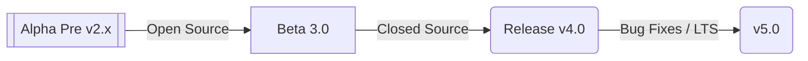

# Block Wars 6

The last open-source version of this game will be available upt o version 3.0.0

## `Progress`



 - [x] Alpha Pre v2.x
 - [ ] Beta 3.0
 - [ ] Releease v4.0
 - [ ] Bug Fixes / LTSv5.0

There will be one last release v3.0 prior to the source being closed since this is a multiplayer online game, it will have strong encryption as well as anti-cheating implementations.  

Unfortunately, having the source code for these components and others will open the doors for hackers and fake versions of the app to become a big problem.  

Therefore, the code is being moved to a private repo.  If you would like to contribute, contact me at 

mike@datafault.net


---


** Currently in progress **
This source code is likely to have bugs and/or security vulerabilities.  This is known and expected as it has not yet been
beta tested.


I will try to commit only fully working versions that will be only limited by lack of features, which there will be many,
however currently are few..  

To play:   find a friend and get them to run the game at the same time. 
Then both of you should Go to the Multiplayer Menu,  followed by the Normal Game button, and lastly Select your powerups.

Once you both have selected powerups, you will be placed (hopefully in the same game if you both are doing things at similar times)
but it could also pair you up with other players if there are any waiting. 

The grid will drop blocks down once both players have joined and are ready. 

To Compile:
Requires Qt 5.15.0 with QtQuick, QML, QtQuickParticles, QtCore, QtNetworking QtWebChannel, and the dependencies for quickflux. 
```
git clone https://github.com/mikeNickaloff/BlockWars6.git
cd BlockWars6
cd shared 
mkdir tools
cd tools
git clone https://github.com/mikeNickaloff/quickflux.git
cd ../../
qmake BlockWars6.pro
make
```

If all goes to plan, compilation is complete. 
